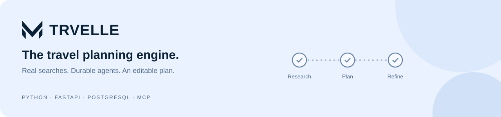
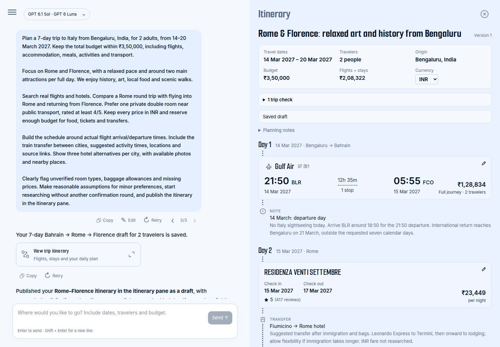
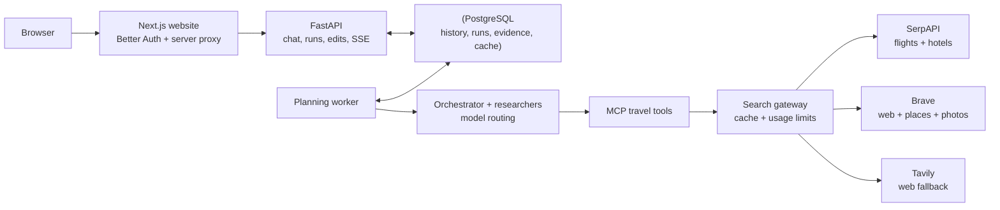

# Trvelle · Backend

**Turn a travel request into a researched, editable itinerary.** Trvelle coordinates a planner and destination researchers, searches real flights and stays, matches activities to places, and saves the evidence behind the plan. A PostgreSQL-backed worker keeps planning independent of the browser connection.


[Website repository](https://github.com/HyperToken9/trvelle-website) · [Local setup](#run-locally) · [API](#api-at-a-glance) · [Architecture](docs/architecture.md) · [Provider guide](docs/providers.md) · [Acceptance checks](docs/completion-checks.md)



*The screenshots show the companion website consuming this backend's saved Italy demo. They include real historical search responses and explicitly unconfirmed details; they do not represent current availability.*

## What this package does

| Capability | Behavior |
| --- | --- |
| Agent coordination | An orchestrator handles the trip; researchers work on destination segments, with at most two researchers running together. |
| Model connections | Per-user model and reasoning choices, personal API keys, supported local subscription connections, and automatic provider fallback. |
| Flight and hotel research | SerpAPI supplies actual search offers, airline logos, property photos, prices and nearby places. |
| Activities and place matching | Brave supplies web evidence and named place matches; Tavily backs up web research. Additional photos are fetched only when needed. |
| Durable planning | Events, checkpoints, completed operations, quotas and worker leases survive a dropped browser connection or worker replacement. |
| Editing | Change flights, swap a hotel for the same stay, edit activities, adjust budget allowances and fetch a specific missing detail. |
| Saved versions | Prompt retry/edit branches and itinerary revisions retain their own messages, selected offers and sources. |
| Targeted updates | Follow-up prompts patch the saved plan, with a stable base context and edit diff that includes manual changes. Inventory tools are enabled only for flight/stay edits. |
| Food | Prompt-driven restaurant and market recommendations, dietary preferences, sourced price tiers, marked meal estimates and rate-specific breakfast inclusion. |
| Cost visibility | Party totals for cards and details, expandable budget children, per-person/per-room calculations and explicitly approximate ranges. Preserve original quotes and budget estimates at their upper bound. |

The backend publishes a **draft** when essential research is incomplete. It does not turn an absent quote into an invented hotel or fare, count a rejected hotel as selected, or report a summary-only continuation as a completed itinerary update.

## How the two packages fit together



| Process | Default address | Responsibility |
| --- | --- | --- |
| Website, in the other repo | `http://localhost:3000` | Login, chat, itinerary and detail panels |
| FastAPI | `http://127.0.0.1:8001` | Owned application API and event streams |
| MCP server | `http://127.0.0.1:8000` | Flight, hotel, segment and itinerary tools |
| Worker | Background process | Claim and execute persisted planning jobs |
| PostgreSQL | `127.0.0.1:54329` with the optional Compose setup | Application data, authentication, search cache and usage ledger |

## Run locally

### 1. Get both repositories

Use **Python 3.12+**, **uv**, **Node.js 22+** for the website, and **PostgreSQL 16+**. Docker Compose is optional and provides a convenient local database.

```bash
git clone https://github.com/DivyamChandalia/trvelle.git
git clone https://github.com/HyperToken9/trvelle-website.git
cd trvelle
uv sync --locked
cp .env.example .env
```

### 2. Configure the backend

Edit the local `.env`. The [example file](.env.example) contains placeholders and optional settings.

| Variable | Purpose |
| --- | --- |
| `DB_URI` | PostgreSQL URI for a database that already exists |
| `BACKEND_API_TOKEN` | Random shared secret; use the same value in the website's server environment |
| `SERPAPI_API_KEY` | Flight and hotel searches |
| `TAVILY_API_KEY` | Web fallback; currently required by the orchestrator's configuration check |
| `BRAVE_API_KEY` | Default web research and automatic activity place/photo matching |
| `GOOGLE_API_KEY` / `OPENROUTER_API_KEY` | Optional shared model credentials; alternatively configure a personal model connection in the website |
| `POSTGRES_PASSWORD` | Only needed for the optional database container below |

Generate independent random values for the database password and shared token, for example with `openssl rand -hex 32`. Keep them in local environment files. A Gemini/AI Studio key is a model credential; Google website sign-in uses a separate OAuth client.

### 3. Start a database

If you already have PostgreSQL, create a database and put its URI in `DB_URI`; skip the container step. Otherwise set `POSTGRES_PASSWORD` in `.env`, use `trvelle` as the URI's username, and use that same password in `DB_URI`:

```bash
docker compose up -d postgres
```

[compose.yaml](compose.yaml) binds PostgreSQL to loopback port `54329` and retains data in a named volume. The API creates its own tables and additive schema migrations on startup. The website initializes its separate Better Auth tables as described in [its README](https://github.com/HyperToken9/trvelle-website#run-locally).

### 4. Start all three backend processes

Run each command from this repository in a separate terminal:

```bash
# Terminal 1: travel tools
uv run --locked python -m trvelle.tools.mcp_server

# Terminal 2: application API
uv run --locked python -m trvelle.orchestrator.api_wrapper

# Terminal 3: background planner — required for chat requests to make progress
uv run --locked python -m trvelle.orchestrator.worker
```

```bash
curl http://127.0.0.1:8001/health
```

The health response reports database/worker readiness and shared provider configuration. Personal model connections are configured separately in the website. Interactive API schemas are at **[localhost:8001/docs](http://127.0.0.1:8001/docs)**.

### 5. Start the website

Follow the [website quick start](https://github.com/HyperToken9/trvelle-website#run-locally). Set its `DATABASE_URL` to the same PostgreSQL database, `BACKEND_URL` to `http://127.0.0.1:8001`, and `BACKEND_API_TOKEN` to the backend's shared token. Sign in or continue as a guest, configure the AI models, and send a travel request.

## Planning and editing

Questions and general conversation use a read-only assistant with the saved itinerary, current edit diff and recent chat context. They have no search or editing tools and use no search credits. Explicit trip requests start planning; requests to change an existing itinerary use targeted updates. Each answer is saved once, including after a resumed worker run.

1. The API stores an owned run and immediately streams its status.
2. The worker coordinates flight research and destination researchers. Completed operations and evidence are saved before moving on.
3. Real travel offers are referenced by saved identifiers. Hotel offers distinguish property, dates and occupancy; a property name mentioned in notes does not select it.
4. The itinerary is enriched with available place details and images, validated, then published into the website pane.
5. User edits create revisions. Detail lookups target fields such as **Baggage allowance**, **Room configuration** or **Ticket price**, with their notes stored separately.

**Stop**, **Finish with current results** and queued steering operate on persisted jobs. **Resume planning** continues an interrupted run without resetting its budgets. A published draft uses individual detail lookups; a missing overnight stay has a dedicated action for that day.

The current work budget is **8 orchestrator calls, 4 researcher calls per segment, and 10 minutes of active planning**. A run can remain partial when those limits are reached.

## Providers, caching and request limits

| Data | Default provider | Cache lifetime |
| --- | --- | --- |
| Flights | SerpAPI | 15 minutes |
| Hotels and booking offers | SerpAPI | 1 hour |
| Web evidence | Brave, with Tavily fallback | 24 hours |
| Activity places / POI photos | Brave | 7 hours |

The gateway coalesces identical in-flight requests, reserves usage before calling a provider, tracks failures and reset windows, and reuses valid cached responses without spending new credits. Current configured account ceilings are **250 SerpAPI requests** and **1,000 Tavily credits**. Brave defaults to a configurable local ceiling of **100 requests/month**, **20 per run** and **1 request/second**; eight run requests are reserved for place/photo work.

These are application safeguards, not a promise about any provider's subscription limits. Model rate limits are tracked separately; an advertised reset or retry time places that credential/model into cooldown instead of repeatedly calling it.

See [docs/providers.md](docs/providers.md) for model routing, connection setup, developer-only search overrides and the bounded Brave/Tavily comparison.

## API at a glance

Application routes require `x-backend-token`; user-owned routes also require a `user-id`. `/health` is public. In the connected product, the website proxy derives identity from the signed-in session and adds these server-side headers.

| Area | Routes |
| --- | --- |
| Planning | `POST /chat`, `POST /runs/start`, `GET /runs/status`, `GET /runs/events` |
| Run controls | `POST /runs/resume`, `/runs/stop`, `/runs/finish`, `/runs/steer`, `/runs/interrupt` |
| History | `GET /list_chats`, `GET /chat_history`, `POST /chat_version` |
| Itineraries | `GET /tool_call`, `GET /itinerary_versions` |
| Editing | `POST /select_flight`, `/select_hotel`, `/edit_activity`, `/budget_allocation` |
| Enrichment | `POST /fetch_details` with an item and optional field selection |
| Models | `GET /model_catalog`, `GET /model_settings`, `POST /model_key`, `/model_roles`, `/model_account` |
| Diagnostics | `GET /diagnostics`, `GET /search_configuration` |

Use `/docs` for request schemas, ownership parameters and streaming details. The MCP endpoints are internal travel tools, rather than the browser API.

## Development and verification

```bash
# Creates and drops an isolated test database; requires CREATEDB privileges.
uv run --locked python tests/run.py

# Scan repository content without printing credential values.
uv run --locked python scripts/check-secrets.py

# Check whitespace before committing.
git diff --check
```

The suite covers guest credential/history migration and interrupted-link retries, pending authorization cancellation, expired/refreshable connection states, reported refresh resets, ownership, prompt branches, itinerary revisions, durable runs, selected offers, scoped detail lookups, matching, caching, spending limits and model adapters. Recorded travel acceptance fixtures replay without contacting search or model providers. Their quotes are historical evidence; see [tests/fixtures/README.md](tests/fixtures/README.md).

Browser acceptance uses the sibling website checkout and an isolated stack:

```bash
# Install the website dependencies and Playwright Chromium first.
uv run --locked python tests/browser.py
```

The harness creates/drops a disposable PostgreSQL database, uses a local SMTP inbox, starts the API and website on ports 18001/13000, and starts no worker. Website accounts, mail and model-connection files are temporary. Search replay fails closed, and model catalogs are mocked. This checks real sign-up/login/reset, guest linking and isolation, saved drafts/scroll, activity edits/versions, session expiry, mobile focus and reduced motion without spending search credits.

A separate, explicitly invoked live inference check uses your connected account with historical flight/hotel evidence:

```bash
uv run --locked python tests/live_model.py --owner YOUR_BACKEND_USER_UUID
```

It makes at most one researcher and one planner call (each bounded to four minutes), calls no search provider, validates the structured result and writes an ignored `.runtime/acceptance-live-model.json`. It does not publish into a user's chat, and historical quotes are not current availability. Use this only when you intend to spend model allowance.

For deliberate travel-tool replay, set `TRVELLE_SEARCH_MODE=replay` and `TRVELLE_REPLAY_DIR=tests/fixtures/search`. Missing fixtures fail closed. Replay mode affects search tools; it does not disable model inference.

## Code map

```text
trvelle/
├── config/          MCP endpoints and shared model tiers
├── database/        Models, migrations, chat branches and itinerary revisions
├── orchestrator/    API, worker, durable runs, model accounts and routing
├── prompts/         Planner/researcher instructions and tool contracts
├── tools/           Search gateway, travel searches, places and detail lookup
└── utils/           Currency, budget, validation, edits and secret redaction
model-bridge/        Optional local Claude CLI dependency
tests/               Unit, database integration and recorded acceptance tests
docs/                Architecture, providers and product screenshots
compose.yaml         Optional local PostgreSQL service
```

## Current boundaries

- Trvelle researches and edits plans; it does not purchase flights, reserve rooms or issue attraction tickets.
- Future-date schedules, room types, taxes, baggage and booking terms remain unconfirmed unless the returned evidence supports them. Field lookup notes can remain unverified rather than overwriting a quote.
- Photos depend on a confident place match and available provider media. The website expands the text when no usable photo exists.
- Subscription sign-in uses native connection workflows. Claude connects through the unmodified Claude Code CLI: open its sign-in link, then submit its one-time code in Connections. The first connection installs the pinned bridge into private persistent model-account storage using Node.js/npm; later deployments reuse it. CLI credentials are encrypted per user and opened only in a private temporary profile for native operations. Production requires a memory-only filesystem sandbox. No SSH tunnel is needed for Claude. API-key authentication remains available independently.
- Hosting requires all backend processes, persistent PostgreSQL and the encrypted `.runtime/model-accounts` directory/master key. The existing cloud manifests are legacy templates, not a complete deployment of this worker-based stack.

See the [companion website](https://github.com/HyperToken9/trvelle-website) for the user interface and authentication setup.

Credential storage, server isolation, migration and limitations are documented in [Credential security](docs/credential-security.md).

Expanded flight details include provider-returned booking options and a Google Flights fallback. Loading booking sites uses one cached, quota-controlled SerpAPI lookup for the selected complete journey. Booking results preserve the itinerary fare; external POST booking requests use an authenticated, isolated handoff page.

## Affiliate booking links

Optional Travelpayouts conversion runs on the backend when a traveler opens an itinerary booking offer. Set `TRAVELPAYOUTS_API_TOKEN`, `TRAVELPAYOUTS_PROJECT_ID` (`trs`) and `TRAVELPAYOUTS_MARKER` in the backend environment. Production stores these with the other encrypted systemd backend credentials; never pass the token to the browser or publish it in source.

Authenticated `/hotel_booking` and `/flight_booking` resolve offers from the user’s owned itinerary and current revision. The caller cannot supply an arbitrary destination. Original SerpAPI quotes and links remain saved; only the outbound redirect is converted. Recognized direct brand domains can use the official partner-links API. There is no guarantee of affiliate access: each brand must be available for the specified Travelpayouts project.

Successful links are cached for 24 hours; rejected links for 15 minutes. PostgreSQL advisory locks coalesce concurrent calls across processes. A shared per-partner ceiling defaults to 80 requests/minute, below the provider’s 100/minute limit. Retry-After and credential failures put conversion on cooldown. Conversion failures, unsupported brands and unavailable configuration preserve the original booking URL. Request counts and conversion outcomes are stored in the existing search cache/charge/account tables with provider `travelpayouts`; API tokens and personal identifiers are not included in cache payloads or SubIDs.

Flight booking forms with POST payloads and Google hand-off URLs are passed through unchanged because the link API does not reproduce their booking payloads. The website uses SerpAPI’s booking provider offers and does not show a Google Flights booking fallback. Never claim an original provider link is an affiliate link unless the partner API has successfully converted it.

Reference: https://support.travelpayouts.com/hc/en-us/articles/25289759198226-API-for-Travelpayouts-partner-links
