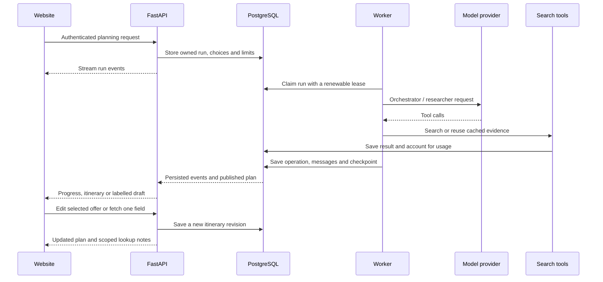

# Architecture

Trvelle separates interactive HTTP requests from long-running planning. The website owns the browser session and interface. The Python API owns authorization and edits. An independent worker executes persisted planning runs against shared evidence, caches and quotas.

## Request lifecycle

The event stream is a view of the saved job, not the job's lifetime. Closing the browser or losing a network connection does not cancel the worker. A replacement worker can claim a stale lease and reuse completed operations.

## Runtime components

| Component | Source | Responsibility |
| --- | --- | --- |
| Application API | `trvelle/orchestrator/api_wrapper.py`, `run_api.py` | Authorization, history, SSE, run controls, selection, edits and detail lookup |
| Durable worker | `trvelle/orchestrator/worker.py` | Execution, heartbeats, stop/finish handling and partial publication |
| Run store | `trvelle/orchestrator/run_store.py` | Persisted job state, events, counters, steering and leases |
| Orchestrator | `trvelle/orchestrator/client.py` | Planner/researcher prompts, tool validation and research handoff |
| Model routing | `model_router.py`, `personal_models.py`, `model_accounts.py` | Catalogs, credentials, role selection, adapters and cooldowns |
| MCP host | `trvelle/tools/mcp_server.py` | Flight, hotel, researcher, segment and itinerary tool endpoints |
| Search gateway | `trvelle/tools/search_gateway.py` | Shared cache, concurrent request coalescing, reservations and quotas |
| Place enrichment | `trvelle/tools/place_search.py` | Name/location identity checks, structured place details and optional photos |
| Scoped enrichment | `trvelle/tools/detail_lookup.py` | Identity-preserving missing-field and booking-offer lookup |

## Persistence

The backend uses SQLAlchemy models in `trvelle/database/models.py`:

- **Users and chats:** `users`, `chat_sessions`, `messages`, `researcher_agents`, `tool_executions`.
- **Planning:** `planning_runs`, `planning_events`, `planning_operations`.
- **Search usage:** `search_cache`, `search_accounts`, `search_charges`, `search_provider_states`.
- **Itinerary edits:** `itinerary_revisions`, `itinerary_fx_snapshots`.

The website's Better Auth tables (`user`, `session`, `account`, `verification`) live alongside these tables. A stable identity mapping connects the signed-in user to an owned backend UUID; the API does not treat a browser-supplied identity as authoritative through the website proxy.

Backend startup serializes additive migrations with a PostgreSQL advisory lock. The website's authentication schema is initialized separately. Tests create an isolated database rather than sharing the live worker's jobs.

## Evidence, selection and revisions

Provider responses are saved independently of model prose. The application derives selectable flight and hotel options from those responses. Exact offer identifiers are validated when publishing or editing a plan.

Hotel offers distinguish dates and occupancy in addition to property identity. A mention in a rejected shortlist or general notes does not select that property. Research prompt compaction keeps hotel names, identifiers and their own quotes together; the supervisor receives a canonical offer catalog beside the research narrative.

Chat retries/edits create sibling prompt branches, retaining earlier replies and preferred follow-up branches. Selecting a branch restores its messages and run. Search evidence from a sibling branch is excluded from its alternatives and publication checks.

Itinerary edits save immutable revisions. Each revision retains its offer sources, selections and currency snapshot. Revision numbers prevent stale edits or simultaneous detail lookups from silently overwriting a newer plan.

## Partial plans and missing information

A run may publish an honest draft when research or its work budget is incomplete. Missing overnight coverage keeps a plan partial. Room, bed, baggage, prices and future-date rules remain explicitly unverified unless evidence supports them.

A published draft uses scoped field lookups. Reports are keyed by item and selected field, so baggage research does not replace ticket-price notes and a price lookup does not become activity visitor information. Research notes alone do not overwrite a fare, certify a room or create a numeric quote.

Resuming an already published draft includes an explicit continuation instruction and the saved offer inventory. A summary without a new publication leaves the existing draft unchanged and partial.

## Media and currency

SerpAPI provides flight logos and hotel images. Brave place matching uses the attraction name and its location together; nearby businesses and ambiguous matches are rejected. Returned thumbnails are reused, and an extra POI photo call is made only when requested and needed. Generic walks and orientation items do not spend automatic photo requests.

Currency preference is sent into travel searches. Foreign amounts preserve their original quote and use a versioned FX snapshot for display conversion. Unavailable rates do not justify relabelling a foreign price. Numeric budget totals distinguish selected quotes, explicit estimates and adjustable allowances.

## Deployment shape

Run the API, worker and MCP host with access to the same PostgreSQL database, model credentials, search keys and shared model-account directory. The website needs its own auth secret and the matching backend token. Keep model-account encryption files and their master key together on persistent storage.

The MCP configuration currently uses loopback URLs on port `8000`; adjust `trvelle/config/mcp_servers.yaml` when the tools are in another container or host. A reverse proxy must preserve streaming responses without buffering. Legacy Cloud Run/build templates in the repository need adaptation for the independent worker and persistent account storage.
